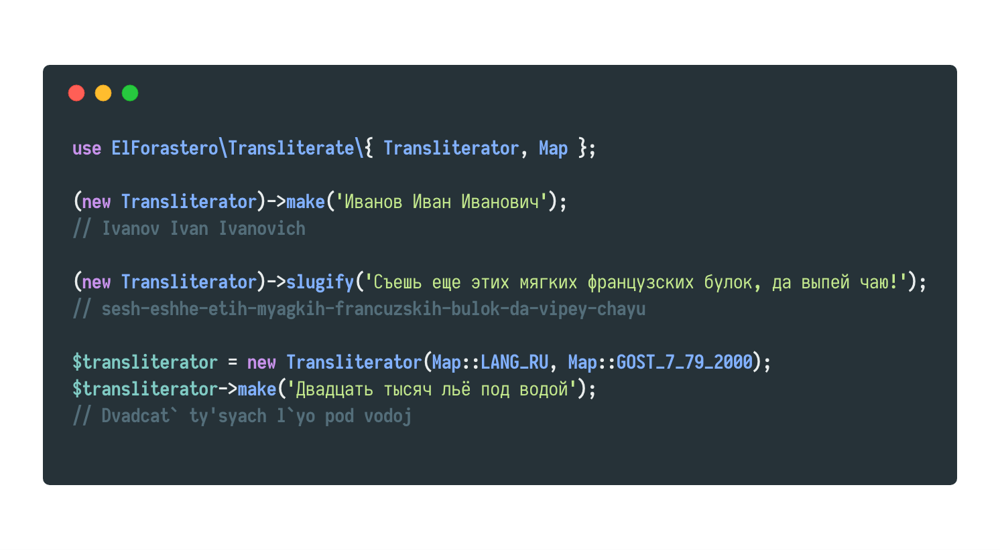

# Transliterate
Небольшой пакет для транслитерации кириллицы. Из коробки поддерживаются 2 карты траслитерации: общепринятая и ГОСТ 7.79-2000. Поддерживается возможность создания своих собственных карт, что, по факту, дает возможность транслитерировать любые языки.



- [Системные требования](#Системные-требования)
- [Установка](#Установка)
- [Конфигурация](#Конфигурация)
- [Использование](#Использование)
- [Создание карт транслитерации](#Создание-карт-транслитерации)
- [Создание трансформеров](#Создание-трансформеров)


### Системные требования
laravel >= 5.6

### Установка
```
composer require elforastero/transliterate
```

Laravel начиная с версии *5.5* не нуждается в дополнительной конфигурации благодаря механизму Package Discovery.

Если вы не используте Package Discovery, необходимо зарегистрировать `Service Provider`, добавив его в массив `providers`, конфигурационного файла `app.php`.

```php
ElForastero\Transliterate\ServiceProvider::class,
```

Если вы хотите использовать алиас, добавьте его в массив `facades` в `app.php`.

```php
'Transliteration' => ElForastero\Transliterate\Facade::class,
```

### Конфигурация

Для копирования конфига `transliterate.php` в директорию `configs` выполните

```bash
php artisan vendor:publish --provider="ElForastero\Transliterate\ServiceProvider"
```

### Использование

Вы можете использовать фасад для транслитерации строк.

```php
use Transliteration;

Transliteration::make('Двадцать тысяч льё под водой');
// "Dvadcat tisyach lyo pod vodoy"
```

Альтернативная карта транслитерации может быть передана вторым параметром.

```php
Transliteration::make('Двадцать тысяч льё под водой', 'gost2000');
// "Dvadcat` ty'syach l`yo pod vodoj"
```

### Создание карт транслитерации

Каждая карта представляет собой ассоциативный массив с символами подлежащими замене в качестве ключей, и значениями на которые они будут заменены.

Карта создается в виде отдельного файла с возвращаемым массивом:

```php
// /resources/maps/ukraine.php

return [
    'ї' => 'i',
    'і' => 'i',
    'є' => 'ie',
];
```

Добавьте путь к созданной карте в массив `maps`, конфига `transliterate.php`:

```php
'ukraine' => dirname(__DIR__) . '/resources/maps/ukraine.php',
```

После этого карту можно использовать.

```php
Transliteration::make('Ваша транслітерація', 'ukraine');
```

### Создание трансформеров

Трансформеры - фукнции которые будут автоматически применены к результату транслитерации. Полезно если вам необходимо каждый раз производить одни и те же действия с транслитераруемой строкой. Регистрируется трансформер в массиве `transformers`.

Например, можно автоматечески убирать конечные пробелы.

```php
ElForastero\Transliterate\Transformer::register(\Closure::fromCallable('trim')),
```

Или дополнительно приводить строки к нижнему регистру.

```php
ElForastero\Transliterate\Transformer::register(\Closure::fromCallable('trim')),
ElForastero\Transliterate\Transformer::register(\Closure::fromCallable('strtolower')),
```

Будьте внимательны, поскольку трансформеры применяются при каждом вызове `Transliteration::make`.